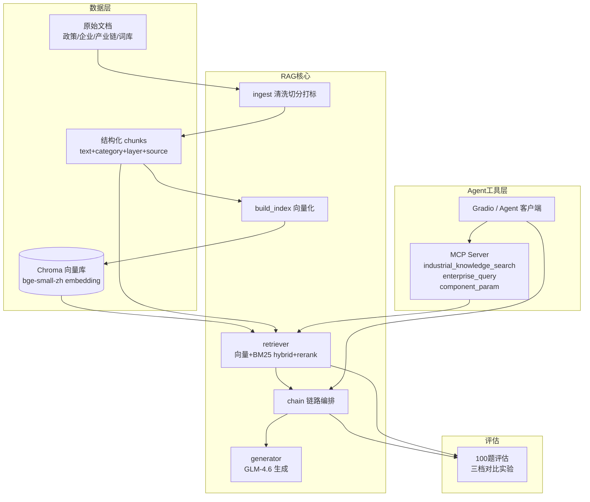
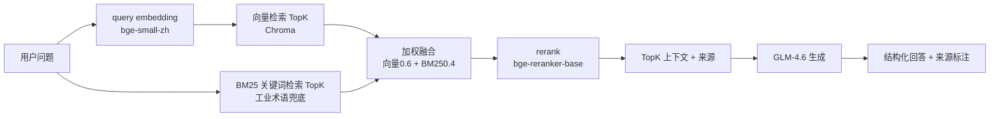
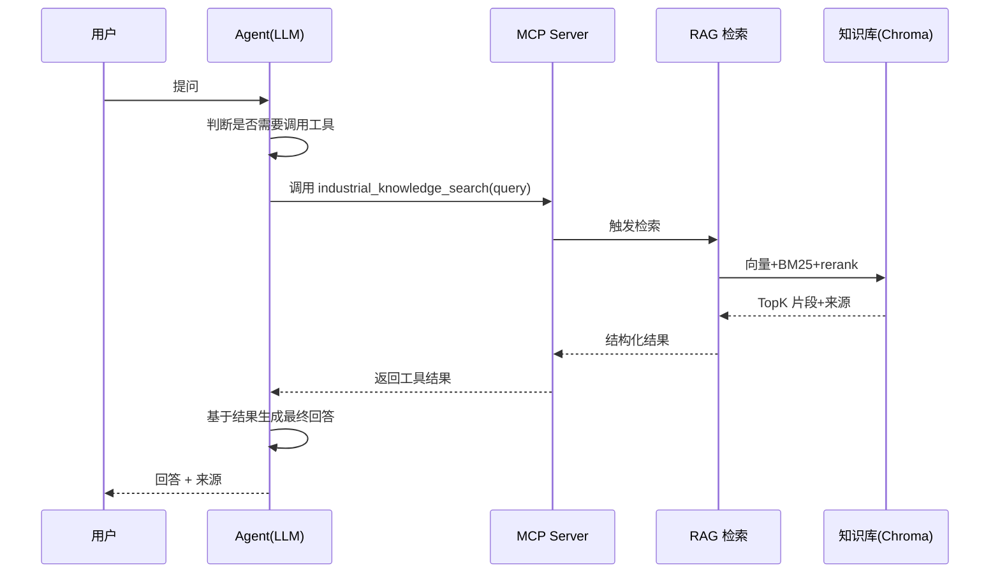

# 项目架构图(Mermaid)

简历/答辩用三张图。以下 Mermaid 源码可在 VS Code Mermaid 插件、typora 或 https://mermaid.live 渲染导出。

## 一、技术架构图

```mermaid
flowchart TB
    subgraph 数据层
        RAW[原始文档<br/>政策/企业/产业链/词库]
        CHUNKS[结构化 chunks<br/>text+category+layer+source]
        CHROMA[(Chroma 向量库<br/>bge-small-zh embedding)]
    end

    subgraph RAG核心
        INGEST[ingest 清洗切分打标]
        BUILD[build_index 向量化]
        RETRIEVER[retriever<br/>向量+BM25 hybrid+rerank]
        GEN[generator<br/>GLM-4.6 生成]
        CHAIN[chain 链路编排]
    end

    subgraph Agent工具层
        MCP[MCP Server<br/>industrial_knowledge_search<br/>enterprise_query<br/>component_param]
        APP[Gradio / Agent 客户端]
    end

    subgraph 评估
        EVAL[100题评估<br/>三档对比实验]
    end

    RAW --> INGEST --> CHUNKS --> BUILD --> CHROMA
    CHROMA --> RETRIEVER
    CHUNKS --> RETRIEVER
    RETRIEVER --> CHAIN --> GEN
    MCP --> RETRIEVER
    APP --> MCP
    APP --> CHAIN
    CHAIN --> EVAL
    RETRIEVER --> EVAL
```

## 二、RAG 流程图

```mermaid
flowchart LR
    Q[用户问题] --> EMB[query embedding<br/>bge-small-zh]
    EMB --> VEC[向量检索 TopK<br/>Chroma]
    Q --> BM25[BM25 关键词检索 TopK<br/>工业术语兜底]
    VEC --> FUSE[加权融合<br/>向量0.6 + BM250.4]
    BM25 --> FUSE
    FUSE --> RR[rerank<br/>bge-reranker-base]
    RR --> CTX[TopK 上下文 + 来源]
    CTX --> LLM[GLM-4.6 生成]
    LLM --> A[结构化回答 + 来源标注]
```

## 三、MCP 工具调用流程图

```mermaid
sequenceDiagram
    participant U as 用户
    participant A as Agent(LLM)
    participant M as MCP Server
    participant R as RAG 检索
    participant K as 知识库(Chroma)

    U->>A: 提问
    A->>A: 判断是否需要调用工具
    A->>M: 调用 industrial_knowledge_search(query)
    M->>R: 触发检索
    R->>K: 向量+BM25+rerank
    K-->>R: TopK 片段+来源
    R-->>M: 结构化结果
    M-->>A: 返回工具结果
    A->>A: 基于结果生成最终回答
    A-->>U: 回答 + 来源
```
